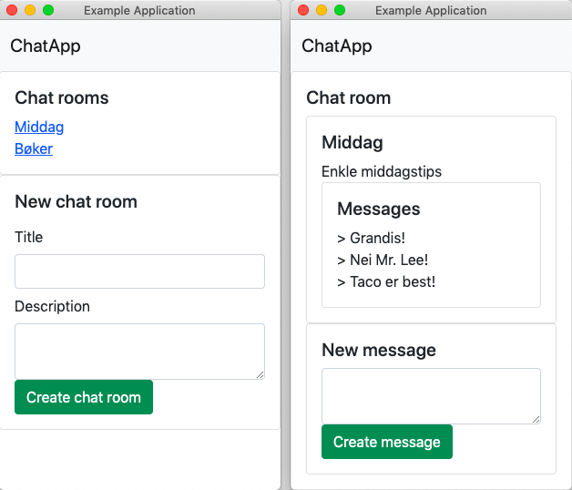

# Oppgave 3

Du skal lage en chat-applikasjon med mulighet for flere rom som brukerne kan sende meldinger til. Databasen er allerede opprettet med følgende SQL-setninger:

 
```
CREATE TABLE ChatRooms (
    id INT NOT NULL AUTO_INCREMENT,
    title TEXT,
    description TEXT,
    PRIMARY KEY(id)
);

CREATE TABLE Messages (
    id INT NOT NULL AUTO_INCREMENT,
    text TEXT,
    chatRoomId INT NOT NULL,
    PRIMARY KEY(id)
);
```

 

Du kan gå ut i fra at databaseoppkoblingen allerede er satt opp.

Applikasjonen skal ha følgende funksjonaliteter:
* Ved oppstart skal en liste over alle chat-rommene vises
* Når en går inn i et chat-rom skal alle meldingene i chat-rommet vises
* Det skal være mulig å legge til et chat rom
* Det skal være mulig å legge til en melding i et chat rom
 
For å få full uttelling på denne oppgaven må kildekoden i applikasjonen være godt strukturert slik at det er enkelt å utvide applikasjonen senere. Det gis ekstra poeng for å ta i bruk Promise-objekter og/eller statisk typesjekking.

En eksempel løsning kan se slik ut, der bildet til venstre viser applikasjonen ved oppstart, og bildet til høyre viser chat-rommet Middag med meldinger:
