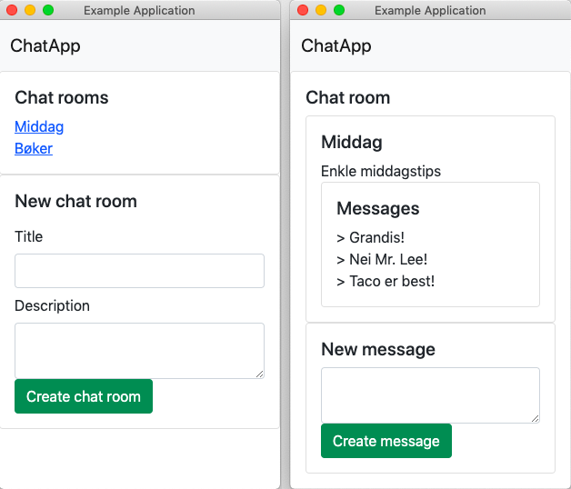

# Oppgave 1

## a)
Lag kode for klassen Kjoretoy. Klassen skal ha to variabler makshastighet og kjorelengde. Disse forteller hvor raskt kjøretøyet kan kjøre og hvor langt kjøretøyet har kjørt.
 
## b)
Lag kode som oppretter et kjøretøy som en instans av klassen Kjoretoy. Velg selv navn på dette objektet og passende verdier på alle variablene. Skriv deretter ut verdiene til skjerm eller webside.
 
## c)
Lag kode for klassen Buss. Klassen skal arve alle variabler og metoder fra moderklassen Kjoretoy. Klassen skal ha en variabel makspassasjerer i tillegg til de som blir arvet. Denne variabelen forteller hvor mange passasjerer det er plass til i bussen.
 
## d)
Lag en metode sjekkAntall i klassen Buss. Metoden skal ha argument antallpassasjerer, sjekker så om antallet passasjerer overstiger makspassasjerer og returnerer en boolsk verdi.
 
## e)
Lag kode som oppretter en buss som en instans av klassen Buss. Velg selv navn på dette objektet og passende verdier for alle variablene. Skriv deretter ut en melding til skjerm eller webside der du bruker sjekkAntall til å teste om det er plass til 50 passasjerer i bussen.
 
## f)
Legg til en variabel i koden som gjør at alle kjøretøy, både vanlige og busser, har fargen hvit.
 
## g)
Lag en metode med valgfritt navn i klassen Buss som beregner hvor mye det koster å leie hele bussen for en dag. Prisen er avhengig størrelsen på bussen (makspassasjerer). Hvis det er 50 seter i bussen blir prisen 50*100 = 5000 kr. I tillegg legges det til moms på 25% slik at totalprisen blir 7500 kr. Bruk objektet du opprettet tidligere og skriv ut totalprisen til skjerm eller webside.

# Oppgave 2

## a) Forklar begrepene objekt, klasse og instans.
Objekt: Et objekt er en samling kode som skal inneholde data og informasjon om en enkelt instans.
Det er rettere sagt en definisjon for selve gjenstanden.
For eksempel objektet Bil vil følgende objekt noteres slik: {farge: "rød", seter: 4, kabriolet: false}.
Dette objektet vil inneha alle de tre oppgitte egenskapene.

Klasse: En klasser er en gruppering av kode som har en viss sammenkobling.
Dette kan både være i form av "backend" metoder som benyttes i en app,
eller for å klassifisere kjøretøy slik som det blir gjort i oppgave 1.
Ved klassen kjoretoy vil en kunne skape mange instanser av følgende klassen,
men som har forskjellige egenskaper. En kan også lage klasser som hører til under større klasser.
Som for eksempel at en klasse CockerSpaniel naturligvis hadde arvet fra super-klassen Hund.

Instans: En instans er kun ett enkelt eksemplar av en klasse.
Om en ser mange biler parkert ved siden av hverandre vil hver enkelt av dem være en egen instans av klassen Bil.

 
## b) Hva gjør funksjonen super() når den blir kalt i en konstruktør?
Funksjonen super() tillater klassen til å arve egenskaper og metoder for "super-klassen" som er over den.
Det vil si hvilken enn klasse som blir spesifisert ved "extend {ClassName}"-forlengelsen etter deklarasjonen.
Den kan også arve spesifiserte verdier ved å oppgi de gitte parameterene i "super()".
Om en f.eks. kun ønsker variablen "antallBein" fra klassen Hund oppgir du super(antallBein);
 

## c) Hva er grunnen til at det vanligvis brukes unntakshåndtering når vi kobler oss til en database?
Grunnen til at dette benyttes er fordi om en ikke kan opprette forbindelse,
eller om signalet er dårlig vil man at applikasjonen vil kunne håndtere feilen i stedet for å krasje.
Ved å bruke f.eks. Promises i JavaScript vil en kunne sørge for at koden gjør andre steg ettersom en forbindelse skulle bli brutt.
Et eksempel på et slik unntak kan være når du laster inn en nettside og bildene ikke har blitt overført enda.
I stedet for at at nettsiden ser dårlig ut, vil det som regel heller plasseres en varsel om at det laster inn, inntil bildet er klart.
 

## d) Det kan være lurt å legge kode som hører til databaseoppkoblingen i en egen klasse. Hvorfor er det slik?
Ved å legge kode for en databaseoppkobling i en egen klasse vil en kunne får bedre struktur i koden sin.
Det vil også være lettere å gruppere de for de forskjellige funksjonalitetene.
Ved å benytte en separat fil, f.eks. "Services.js" der forskjellig kode for databaseoppkoblinger er organisert i klasser vil en også i praksis ha laget en egen modul som kan tas i bruk for kodeprosjektet du trenger det til.
 

## e) Hvis du skulle lagre påloggingsinformasjonen til databasen i programmet ditt, hvordan ville du gjort dette?
På samme måte som en burde organisere kode for API- og databaseoppkoblinger,
som nevnt i deloppgave d vil det være en god idé å plassere følgende kode i en egen fil.
Følgende påloggingsinformasjon for databaseoppkoblingen ville jeg deretter plassert i en klasse slik at vil har en definisjon på hvordan følgende informasjon ser ut.
Ved å gjøre dette vil en kunne opprette flere instanser for forskjellige databaser enkelt om det skulle være nødvendig.
Deretter ville jeg laget en instanse for den databaseoppkoblingen jeg trenger, og eksportert den.
I den filen jeg trenger tilgang til oppkoblingen ville jeg så importert denne "modulen" jeg nå har laget.

# Oppgave 3

Du skal lage en chat-applikasjon med mulighet for flere rom som brukerne kan sende meldinger til. Databasen er allerede opprettet med følgende SQL-setninger:

 
```
CREATE TABLE ChatRooms (
    id INT NOT NULL AUTO_INCREMENT,
    title TEXT,
    description TEXT,
    PRIMARY KEY(id)
);

CREATE TABLE Messages (
    id INT NOT NULL AUTO_INCREMENT,
    text TEXT,
    chatRoomId INT NOT NULL,
    PRIMARY KEY(id)
);
```

 

Du kan gå ut i fra at databaseoppkoblingen allerede er satt opp.

Applikasjonen skal ha følgende funksjonaliteter:
* Ved oppstart skal en liste over alle chat-rommene vises
* Når en går inn i et chat-rom skal alle meldingene i chat-rommet vises
* Det skal være mulig å legge til et chat rom
* Det skal være mulig å legge til en melding i et chat rom
 
For å få full uttelling på denne oppgaven må kildekoden i applikasjonen være godt strukturert slik at det er enkelt å utvide applikasjonen senere.
Det gis ekstra poeng for å ta i bruk Promise-objekter og/eller statisk typesjekking.

En eksempel løsning kan se slik ut, der bildet til venstre viser applikasjonen ved oppstart, og bildet til høyre viser chat-rommet Middag med meldinger:


